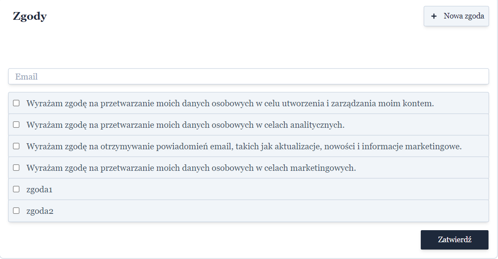
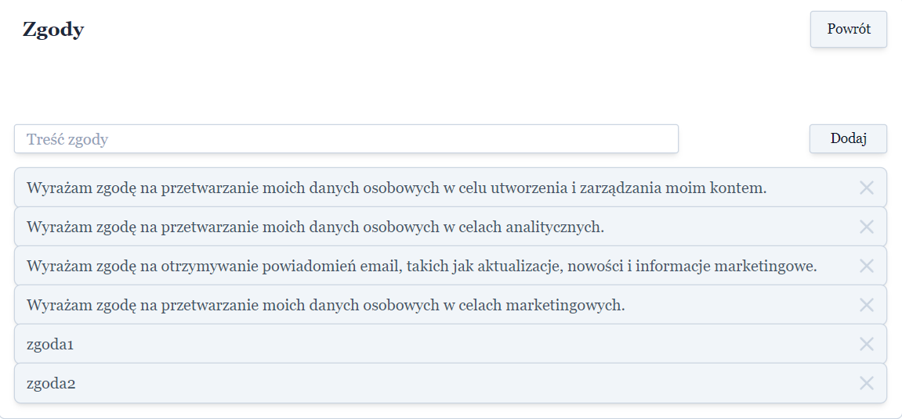

# Funkcje

- Utworzenie/usunięcie zgody
- Wybranie utworzonych zgód
- Zatwierdzenie zgód dla wpisanego emaila

## Baza danych

1. Tworzenie zgody jest możliwe po kliknięciu w przycisk "+ Nowa Zgoda". Po wpisaniu treści tworzy nowy obiekt "Agreement":
- id - Unikalny identyfikator obiektu zgody
- content - Treść zgody
- canBeRemoved - Atrybut wskazujący, czy można usunąć wybraną zgodę
2. Usunięcie zgody następuje po wciśnięciu "X" umieszczonego przy określonej zgodzie.
3. Przy tworzeniu powiązania emaila z wybranymi zgodami, korzystając z przycisku "Zatwierdź" znajdującym się na głównym ekranie, tworzone są dwa obiekty:
- User:
  a) id - Unikalny identyfikator użytkownika
  b) email - Podany przez użytkownika adres email
- UserAgreement łączący relację zgody z użytkownikiem w jednym obiekcie:
  a) formId - Identyfikator stworzonej relacji
  b) userId - Obcy identyfikator użytkownika
  c) agreementId - Obcy identyfikator zgody
  d) assignedAt - Czas zatwierdzenia wybranej zgody
  
## Zrzuty ekranu

 - Strona główna, w której użytkownik ma możliwość wpisania emaila, wybrania zgód i zatwierdzenia wyborów.

 - Strona tworzenia zgód przy pomocy pola tekstowego oraz przycisku "Dodaj".

